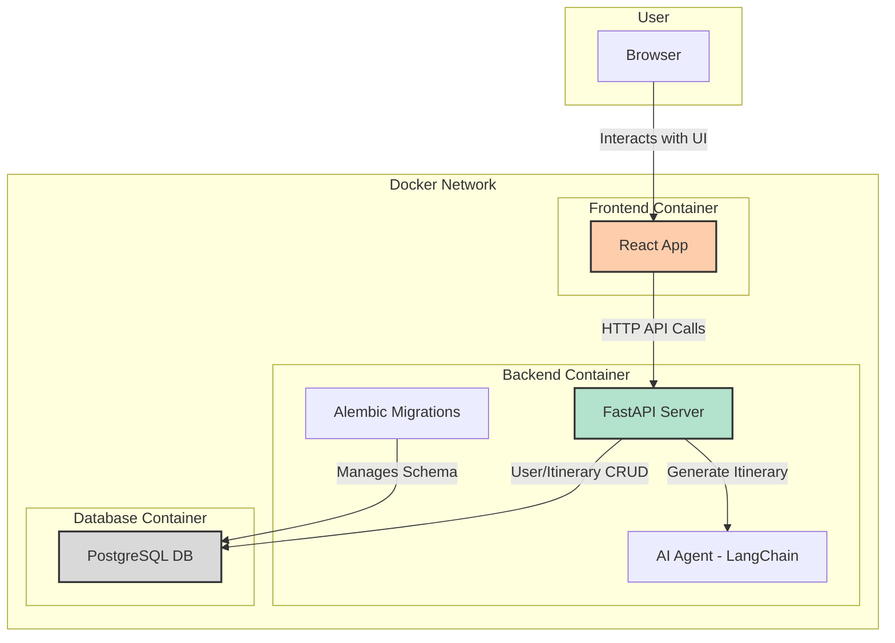

# AI-Powered Trip Planner

This is a full-stack web application that allows users to generate travel itineraries using an AI-powered agent. Users can register, log in, create travel plans for specific destinations, view their past trips, and download itineraries as PDF files.

## Features

-   **User Authentication:** Secure user registration and JWT-based login system.
-   **AI Itinerary Generation:** Dynamically generates multi-day travel itineraries using a Large Language Model (LLM).
-   **Destination & Duration:** Users can specify a destination and the number of days for their trip.
-   **Past Trips:** View a dashboard of all previously generated itineraries.
-   **PDF Download:** Download any itinerary as a formatted PDF document.
-   **Responsive UI:** A modern, responsive user interface built with React and Tailwind CSS.
-   **Containerized:** The entire application is containerized with Docker for easy setup and deployment.

## System Architecture

The application uses a microservices-oriented architecture with a separate frontend and backend, orchestrated by Docker Compose.



## Tech Stack

| Category          | Technology                                                              |
| ----------------- | ----------------------------------------------------------------------- |
| **Frontend**      | [React](https://reactjs.org/), [Tailwind CSS](https://tailwindcss.com/)  |
| **Backend**       | [FastAPI](https://fastapi.tiangolo.com/), [Python 3.12](https://www.python.org/) |
| **Database**      | [PostgreSQL](https://www.postgresql.org/), [SQLAlchemy](https://www.sqlalchemy.org/), [Alembic](https://alembic.sqlalchemy.org/) |
| **AI/LLM**        | [LangChain](https://www.langchain.com/)                                 |
| **Containerization**| [Docker](https://www.docker.com/), [Docker Compose](https://docs.docker.com/compose/) |
| **PDF Generation**| [FPDF2](https://github.com/py-pdf/fpdf2)                                 |

## Prerequisites

Before you begin, ensure you have the following installed on your system:
-   [Docker](https://www.docker.com/get-started)
-   [Docker Compose](https://docs.docker.com/compose/install/)

## Project Setup

### 1. Clone the Repository
```sh
gh repo clone Shubham281103/PlanMyTrip
cd <project-root-directory>
```

### 2. Start the Project with Docker
```sh
docker-compose up --build -d
```
This will start the Postgres database, backend (FastAPI), and frontend (React) containers.

### 3. Run Database Migrations (First Time or After Model Changes)
You must run Alembic migrations to create/update the database schema. This is required on any new environment (laptop, server, etc.).

```sh
docker-compose exec backend alembic -c alembic.ini upgrade head
```

- This will create all necessary tables in the database.
- If you change models in the backend, generate a new migration and upgrade again:
  ```sh
  docker-compose exec backend alembic -c alembic.ini revision --autogenerate -m "describe your change"
  docker-compose exec backend alembic -c alembic.ini upgrade head
  ```

### 4. Access the App
- Frontend: [http://localhost:3000](http://localhost:3000)
- Backend API: [http://localhost:8000/docs](http://localhost:8000/docs)

### 5. Default Database Credentials (from docker-compose.yml)
- **Database:** trip_planner
- **User:** trip_planner_user
- **Password:** password
- **Host:** localhost (for local connections)
- **Port:** 5432

---

## Notes
- Always run migrations after cloning or setting up on a new machine.
- If you reset the database, re-run the migrations to recreate tables.
- For development, you can remove the Postgres volume to reset the database:
  ```sh
  docker-compose down
  docker volume rm updated_trip_planner_postgres_data
  docker-compose up -d
  docker-compose exec backend alembic -c alembic.ini upgrade head
  ```

---

For any issues, check the backend and database logs, and ensure migrations are up to date.

## Project Structure

The project is organized into two main directories:

-   `Backend/`: Contains the FastAPI backend application.
    -   `app/`: Core application logic, including models, schemas, CRUD operations, and API routes.
    -   `alembic/`: Database migration scripts.
    -   `Dockerfile`: Instructions to build the backend Docker image.
    -   `requirements.txt`: Python dependencies.
-   `travel-itinerary-frontend/`: Contains the React frontend application.
    -   `src/`: Source code for the React components, API services, and styles.
    -   `public/`: Public assets.
    -   `Dockerfile`: Instructions to build the frontend Docker image.
    -   `package.json`: Node.js dependencies.
-   `docker-compose.yml`: Defines and orchestrates the multi-container application.
-   `Project_Workflow_Documentation.md`: Detailed documentation on the project workflow and architecture.
-   `README.md`: This file. 