# 🤖 Agentic AI Trip Planner - PlanMyTrip

This is a **next-generation agentic AI application** that autonomously generates personalized travel itineraries using intelligent AI agents. Unlike traditional applications, this system features an AI agent that can reason, adapt, and make decisions to create truly personalized travel experiences.

## 🧠 What Makes This Agentic?

- **Intelligent Decision Making**: The AI agent analyzes user preferences, destination characteristics, and travel constraints to make smart recommendations
- **Autonomous Planning**: The agent independently structures daily activities, optimizes routes, and balances different aspects of the trip
- **Contextual Understanding**: Uses advanced prompt engineering to understand nuanced travel preferences and adapt recommendations accordingly
- **Dynamic Personalization**: Each itinerary is uniquely crafted based on real-time analysis of user inputs and preferences
- **Reasoning Capabilities**: The agent can reason about travel logistics, timing, and user satisfaction to create optimal plans

This is a full-stack web application that allows users to generate personalized travel itineraries using an AI-powered agent. Users can register, log in, create travel plans with custom preferences for specific destinations, view their past trips, and download itineraries as PDF files.

## 🚀 Features

### 🤖 Agentic AI Capabilities
-   **Intelligent Itinerary Generation:** The AI agent autonomously creates comprehensive, multi-day travel plans with intelligent reasoning about logistics, timing, and user preferences
-   **Adaptive Personalization:** The agent dynamically adapts recommendations based on real-time analysis of user preferences and destination characteristics
-   **Contextual Decision Making:** Advanced prompt engineering enables the agent to understand nuanced travel requirements and make intelligent suggestions
-   **Autonomous Route Optimization:** The agent independently structures daily activities and optimizes travel routes for maximum efficiency and satisfaction

### 👤 User Experience
-   **User Authentication:** Secure user registration and JWT-based login system with profile management
-   **Trip Preferences & Personalization:** 
    - Trip themes (Adventure, Religious, Cultural, Foodie, Relaxation, Romantic, Family-friendly)
    - Budget levels (low, medium, high)
    - Pace preferences (relaxed, packed)
    - Travel modes (walking, cab, public transport, self drive)
    - Group types (solo, couple, family, friends, senior friendly)
-   **Smart Recommendations:** AI agent generates theme-based and group-specific activity suggestions with contextual reasoning
-   **Destination & Duration:** Users can specify a destination and the number of days for their trip
-   **Past Trips:** View a dashboard of all previously generated itineraries with their preferences
-   **PDF Download:** Download any itinerary as a formatted PDF document
-   **Profile Management:** View profile details and change password functionality

### 🛠️ Technical Features
-   **Responsive UI:** A modern, responsive user interface built with React and Tailwind CSS
-   **Containerized:** The entire application is containerized with Docker for easy setup and deployment
-   **Real-time AI Processing:** LangChain-powered AI agent processes requests in real-time with structured output validation

## 🏗️ System Architecture

The application uses a **microservices-oriented architecture** with an **intelligent AI agent** at its core, orchestrated by Docker Compose. The AI agent acts as the brain of the system, making autonomous decisions about itinerary generation and personalization.

```mermaid
graph TD
    subgraph User
        A[Browser]
    end

    subgraph "Docker Network"
        subgraph "Frontend Container"
            B[React App]
        end

        subgraph "Backend Container"
            C[FastAPI Server]
            D[🤖 AI Agent - LangChain<br/>Autonomous Decision Making]
            E[Alembic Migrations]
        end

        subgraph "Database Container"
            F[PostgreSQL DB]
        end

        B -- "HTTP API Calls" --> C
        C -- "User/Itinerary CRUD" --> F
        C -- "🤖 AI Agent Request<br/>Autonomous Planning" --> D
        D -- "📊 Structured Output<br/>Validated Results" --> C
        E -- "Manages Schema" --> F
    end

    A -- "Interacts with UI" --> B

    style F fill:#d9d9d9,stroke:#333,stroke-width:2px
    style C fill:#b3e2cd,stroke:#333,stroke-width:2px
    style B fill:#fdcdac,stroke:#333,stroke-width:2px
    style D fill:#ff9999,stroke:#333,stroke-width:3px
```



## 🛠️ Tech Stack

| Category          | Technology                                                              |
| ----------------- | ----------------------------------------------------------------------- |
| **🤖 AI/Agentic** | [LangChain](https://www.langchain.com/) - Autonomous AI Agent Framework |
| **Frontend**      | [React](https://reactjs.org/), [Tailwind CSS](https://tailwindcss.com/)  |
| **Backend**       | [FastAPI](https://fastapi.tiangolo.com/), [Python 3.12](https://www.python.org/) |
| **Database**      | [PostgreSQL](https://www.postgresql.org/), [SQLAlchemy](https://www.sqlalchemy.org/), [Alembic](https://alembic.sqlalchemy.org/) |
| **Containerization**| [Docker](https://www.docker.com/), [Docker Compose](https://docs.docker.com/compose/) |
| **PDF Generation**| [FPDF2](https://github.com/py-pdf/fpdf2)                                 |

## 🧠 AI Agent Architecture

The core of this application is an **intelligent AI agent** built with LangChain that demonstrates true agentic behavior:

### Agent Capabilities
- **Autonomous Decision Making**: The agent independently analyzes user inputs and makes intelligent decisions about itinerary structure
- **Contextual Reasoning**: Uses advanced prompt engineering to understand complex travel requirements and preferences
- **Dynamic Adaptation**: Adapts recommendations in real-time based on user feedback and changing requirements
- **Structured Output Generation**: Produces validated, structured JSON responses using Pydantic models
- **Multi-step Planning**: Breaks down complex travel planning into logical, sequential steps

### How the Agent Works
1. **Input Processing**: Receives user preferences, destination, and duration
2. **Context Analysis**: Analyzes travel themes, budget constraints, and group dynamics
3. **Intelligent Planning**: Creates optimized daily schedules with appropriate activities
4. **Validation**: Ensures output meets structured format requirements
5. **Personalization**: Tailors recommendations based on specific user preferences

### Agent vs Traditional Applications
Unlike traditional rule-based systems, this AI agent:
- **Thinks** about travel logistics and user satisfaction
- **Adapts** to different travel styles and preferences
- **Learns** from context to make better recommendations
- **Reasons** about timing, location, and activity compatibility
- **Creates** unique, personalized experiences for each user

## Prerequisites

Before you begin, ensure you have the following installed on your system:
-   [Docker](https://www.docker.com/get-started)
-   [Docker Compose](https://docs.docker.com/compose/install/)

## Project Setup

### 1. Clone the Repository
```sh
gh repo clone Shubham281103/PlanMyTrip
cd <project-root-directory>
```

### 2. Start the Project with Docker
```sh
docker-compose up --build -d
```
This will start the Postgres database, backend (FastAPI), and frontend (React) containers.

### 3. Run Database Migrations (First Time or After Model Changes)
You must run Alembic migrations to create/update the database schema. This is required on any new environment (laptop, server, etc.).

```sh
docker-compose exec backend alembic -c alembic.ini upgrade head
```

- This will create all necessary tables in the database.
- If you change models in the backend, generate a new migration and upgrade again:
  ```sh
  docker-compose exec backend alembic -c alembic.ini revision --autogenerate -m "describe your change"
  docker-compose exec backend alembic -c alembic.ini upgrade head
  ```

### 4. Access the App
- Frontend: [http://localhost:3000](http://localhost:3000)
- Backend API: [http://localhost:8000/docs](http://localhost:8000/docs)

### 5. Default Database Credentials (from docker-compose.yml)
- **Database:** trip_planner
- **User:** trip_planner_user
- **Password:** password
- **Host:** localhost (for local connections)
- **Port:** 5432

---

## Notes
- Always run migrations after cloning or setting up on a new machine.
- If you reset the database, re-run the migrations to recreate tables.
- For development, you can remove the Postgres volume to reset the database:
  ```sh
  docker-compose down
  docker volume rm updated_trip_planner_postgres_data
  docker-compose up -d
  docker-compose exec backend alembic -c alembic.ini upgrade head
  ```

---

For any issues, check the backend and database logs, and ensure migrations are up to date.

## Project Structure

The project is organized into two main directories:

-   `Backend/`: Contains the FastAPI backend application.
    -   `app/`: Core application logic, including models, schemas, CRUD operations, and API routes.
    -   `alembic/`: Database migration scripts.
    -   `Dockerfile`: Instructions to build the backend Docker image.
    -   `requirements.txt`: Python dependencies.
-   `travel-itinerary-frontend/`: Contains the React frontend application.
    -   `src/`: Source code for the React components, API services, and styles.
    -   `public/`: Public assets.
    -   `Dockerfile`: Instructions to build the frontend Docker image.
    -   `package.json`: Node.js dependencies.
-   `docker-compose.yml`: Defines and orchestrates the multi-container application.
-   `Project_Workflow_Documentation.md`: Detailed documentation on the project workflow and architecture.
-   `README.md`: This file.